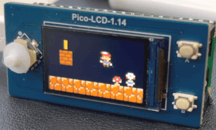
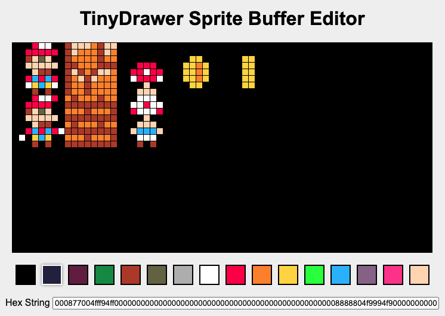
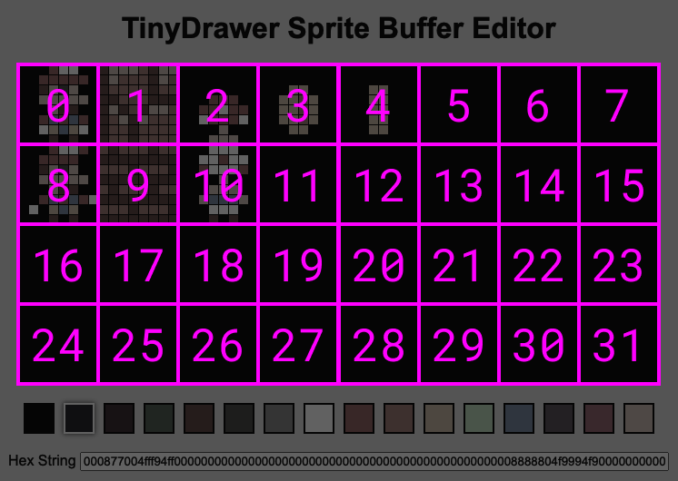

# TinyDrawer

- [Features](#features)
- [Get Started](#get_started)
- [Limitations](#limitations)
- [License](#license)

## 2D Game Engine for Pi Pico
TinyDrawer is a compact game engine for [Rasberry Pi Pico devices](https://www.raspberrypi.com/products/raspberry-pi-pico) written in [MicroPython](https://micropython.org) by [Saranomy](https://github.com/Saranomy). In its current development stage, it has a collection of methods inspired by [PICO-8 game engine](https://www.lexaloffle.com/pico-8.php) to ultimately render pixels to [framebuf.FrameBuffer](https://docs.micropython.org/en/latest/library/framebuf.html).

| [Waveshare's Pico LCD 1.14](https://www.waveshare.com/wiki/Pico-LCD-1.14) | [ZhongJungYuan's 1.69 TFT LCD](https://www.aliexpress.com/i/1005004721706705.html) |
| - | - |
|  |  |

<a name="features"></a>

## Features

#### TinyDrawer

```python
import tiny_drawer

# Initilize TinyDrawer
td = tiny_drawer.TinyDrawer()
```

You can change the zoom level and display's width and height

```python
# Initilize TinyDrawer
td = tiny_drawer.TinyDrawer(display_w = 240, display_h = 135, zoom = 5)
```


#### Sprite Buffer
Just like PICO-8, TinyDrawer comes with the sprite buffer that can store 32 sprites (8 columns and 4 rows, and each sprite is 8x8 pixels) by default. Design your sprites using [TinyDrawer Sprite Buffer Editor](https://html-preview.github.io/?url=https://github.com/saranomy/tinydrawer/blob/master/editor.html)



At the bottom, copy the Hex String, and call `set_buffer_hex(hex_string)` to load this sprite buffer to your program.

```python
# replace the sprite buffer data
td.set_buffer_hex("000877004fff94ff...") # <- arg: your hex string
```

You can change the sprite buffer size by calling `set_buffer(buffer, buffer_w, buffer_h)`.

```python
# change buffer size to 12 x 2
w, h = 12, 2
td.set_buffer(bytearray(64 * w * h), buffer_w = w, buffer_h = h)
```

#### Sprite Index

The sprite index `n` indicates which sprite from the Sprite Buffer should be drawn. The top-left sprite has an index of `n = 0`, while the first sprite in the second row has an index of `n = 8`.



#### Draw Sprite

Use `spr(fb, n, x, y)` to draw a sprite at index `n` to the framebuf.FrameBuffer `fb` at `x`, `y` position.

```python
# spr(fb, n, x, y, w = 1, h = 1, flip_x = False, flip_y = False)

# draw a 8x8 sprite 0 at (20, 10)
td.spr(fb, 0, 20, 10)

# draw a 16x16 sprite 1 at (120, 30)
td.spr(fb, 1, 120, 30, w = 2, h = 2)

# draw a 8x8 sprite 8 but flipping the sprite horizontally
td.spr(fb, 8, 0, 0, flip_x = True)
```

#### Color
TinyDrawer comes with 16 colors:

| Index | Name | Hex |
| - | - | - |
| 0 | Black |  `#000000` |
| 1 | Dark Blue |  `#242449` |
| 2 | Dark Purple |  `#6D2449` |
| 3 | Dark Green |  `#009249` |
| 4 | Brown |  `#B64924` |
| 5 | Dark Grey |  `#6D6D49` |
| 6 | Light Grey |  `#B6B6B6` |
| 7 | White |  `#FFFFFF` |
| 8 | Red |  `#FF0048` |
| 9 | Orange |  `#FF9100` |
| 10 | Yellow |  `#FFDB24` |
| 11 | Green |  `#00FF24` |
| 12 | Blue |  `#24B6FF` |
| 13 | Lavender |  `#926d92` |
| 14 | Pink |  `#FF4992` |
| 15 | Light Peach |  `#FFDBB6` |

To use a color on the framebuf, call `color(index)` to get the int number in RGB565 color format.

```python
# fill the entire display with black color
fbuff.fill(td.color(0))

# draw an orange rectangle
fbuff.fill_rect(0, 0, 240, 100, td.color(9))
```

#### Replace Color

By default, the black color `0` on the Sprite Buffer is considered as a transparent color when drawing. Use `pal(c0, c1)` to swap colors before drawing.

For example, to draw the black color pixels on the framebuf:
1. On the [Editor](https://html-preview.github.io/?url=https://github.com/saranomy/tinydrawer/blob/master/editor.html), replace black color with white color `0` or any other color
2. Optional: Call `pal()` to reset the palette
3. Call `pal(7, 0)` to replace white `7` with black `0` when drawing
4. Call `str(fb, n, x, y)` to draw
5. Optional: Call `pal()` to clear the color replacement

Another example, we can turn Mario into Luigi by swapping colors on sprite `0`

```python
# replace any red with green
pal(8, 11) 

# draw mario sprite
spr(fb, 0, 100, 100)

# reset the color replacement
pal()
```

<a name="get_started"></a>

## Get Started

In this demo, we use [Pi Pico W](https://www.pishop.ca/product/raspberry-pi-pico-w/) and [Waveshare's Pico LCD 1.14](https://www.pishop.ca/product/1-14inch-lcd-display-module-for-raspberry-pi-pico-65k-colors-240-135-spi/) which has joystick controller and buttons. We will run *example_mario.py* on the Pico. You can use any Pico device and any display screen as long as they meet the following requirements.

#### Hardware Requirement
- Have one of the [Rasberry Pi Pico devices](https://www.raspberrypi.com/products/raspberry-pi-pico)
- Have a SPI [ST7789](https://newhavendisplay.com/content/datasheets/ST7789V.pdf) display connected to Pi Pico
- Make sure the display color format is set to RGB565
- Have a code that can send [framebuf.FrameBuffer](https://docs.micropython.org/en/latest/library/framebuf.html) to the display


#### Let's Run

1. Complete the Get Started guide with the [Pi Pico](https://projects.raspberrypi.org/en/projects/getting-started-with-the-pico)
2. Install [Thonny](https://thonny.org/), and connect to the Pi Pico


3. Upload `lc_1inch14.py` to the Pi Pico. This is a demo file from [Waveshare's Pico LCD 1.14](https://www.waveshare.com/wiki/Pico-LCD-1.14) tutorial. We modified it to be used on different screen sizes and orientations. If you use a different display, use the demo file from your manufacturer, make sure that the class is a child of `framebuf.FrameBuffer`

```python
class LCD_1inch14(framebuf.FrameBuffer):
    ...
```

4. Upload `tiny_drawer.py` to the Pi Pico
5. Upload `example_mario.py` to the Pi Pico. You can change it to `main.py`
6. Open `example_mario.py` on Thonny, and check the configuration of TinyDrawer

```python
display_w = 240
display_h = 135

td = tiny_drawer.TinyDrawer(display_w = display_w, display_h = display_h)
...
```

8. Run the `example_mario.py` on the Pi Pico
9. On [Waveshare's Pico LCD 1.14](https://www.waveshare.com/wiki/Pico-LCD-1.14), press the B button to turn off the Mario's autorun mode. Then you can move the player using left stick, right stick and the A button.

<a name="license"></a>

## Limitations

Updating more pixels means a drop in framerate since we have to constantly run `spr()`. 

From the `example_mario.py`
- The floor of the level (as well as the background above the coin) is drawn only once before entering the game loop since the player cannot obstruct its view and the camera does not need to move.

In the future, we plan to introduce multi-thread to speed up the drawing process.

<a name="license"></a>

## License

The source code for the site is licensed under the MIT license, which you can find in the LICENSE file.

All graphical assets are licensed under the [Creative Commons Attribution 4.0 International License](https://creativecommons.org/licenses/by/4.0).
